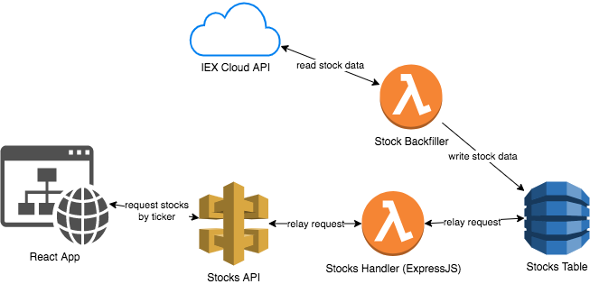

# Stocks

This is an app for tracking stock data in real time. All data comes from the [IEX Cloud API](https://iexcloud.io/).

### Quickstart
The front end was bootstrapped with [create react app](https://create-react-app.dev/). To start a local development server run: `npm start`.

The back end uses AWS Amplify. To make changes, you will need to set up an AWS account and create an Amplify app. There will be an option to create an app from an existing source.

### Directory Structure
backend: `/amplify`
frontend: `/src`

### Architecture

